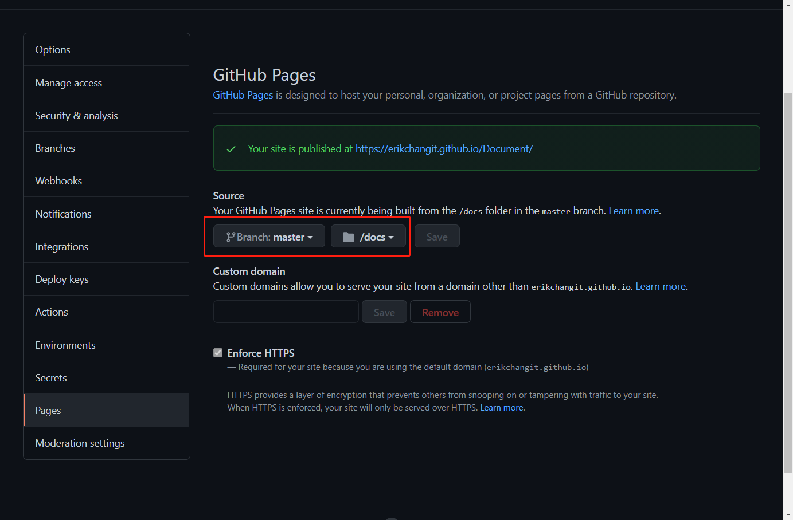

## Docsify 搭建一个免费的博客平台

作为一名`专业`的研发人员，有一个自己的技术博客是非常重要的吧。一个研发人员平时如果不会记录一些自己开发时遇到的坑，那肯定成长的不快。

目前有很多专门用来写博客和文档的平台，比如博客园、CSDN、简书等，但这些都是某些公司旗下的，用起来自然不是很爽。自己搭建一个有自己独特风格的博

客，自己来管理，那才会有归属感。很久很久以前，搭建博客需要将内容放到服务器上，这也就意味着你需要花钱去维持博客的正常运行。现在，可以让你免费快

速地搭建一个属于你自己的博客，是不是很激动，很想学习呢？

好啦，废话不多说，撸起袖子开始干吧！

#### 本地搭建服务

##### 安装 docsify

安装前请先确保已安装 nodejs

```undefined
npm i docsify-cli -g
```

##### 初始化

```kotlin
docsify init ./docs
```

初始化之后，会在 docs 目录下生成 3 个文件：

- .nojekyll：让gitHub不忽略掉以 _ 打头的文件
- index.html：整个网站的核心文件
- README.md：默认页面

##### 添加文档

将自己的 markdown 文档放到 docs 目录下

有一些格式需要自己定制，参考 https://blog.csdn.net/qq_34158555/article/details/95741714

##### 预览文档

进入docs目录，运行本地服务器 `docsify serve`，然后在浏览器中打开 [http://localhost:3000](http://localhost:3000/)即可

```cpp
docsify serve
```

#### 部署到 github

- 在gitHub 建个仓库
- 将仓库 clone 大到本地
- 将 docs 目录放入此 git 中
- 提交 git
- 在 github 仓库 settings 中找到 github pages，选择 docs 目下，Save

  

- 打开 Github Pages 中提示的网址，您就能看到博客啦
