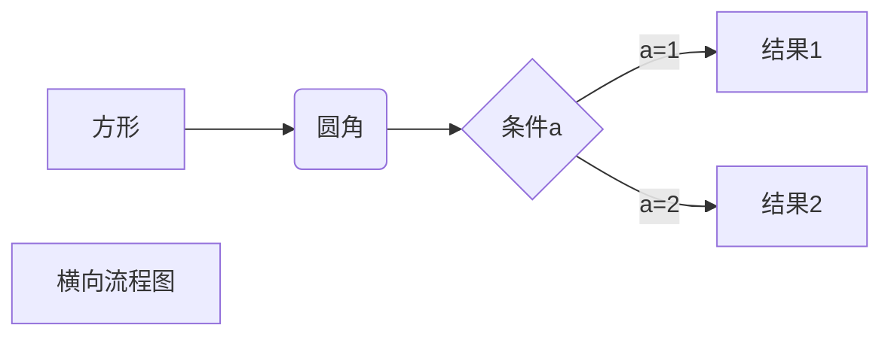
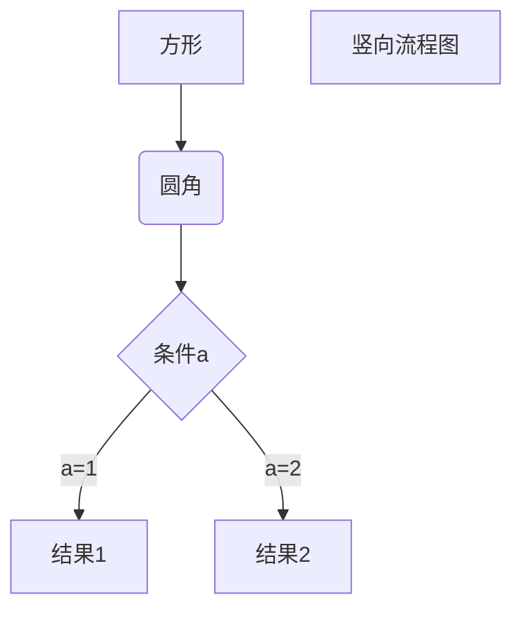
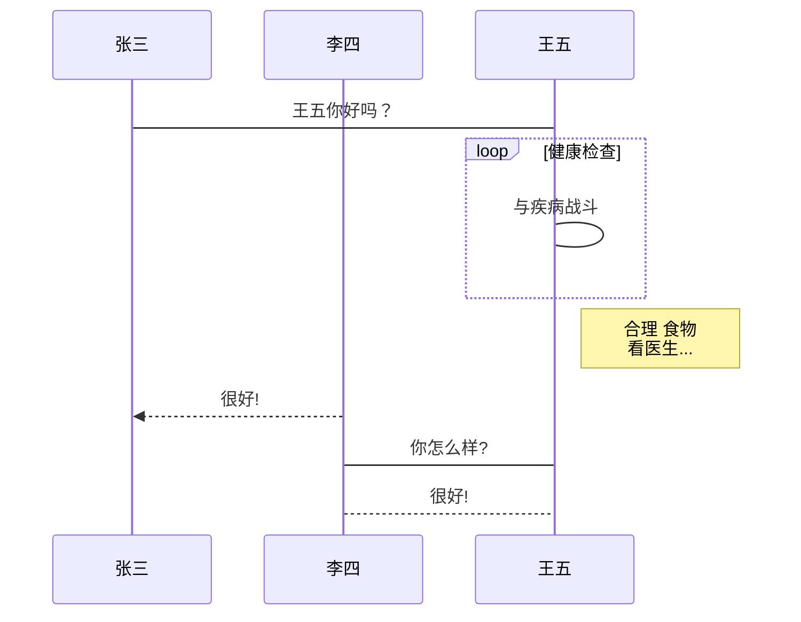
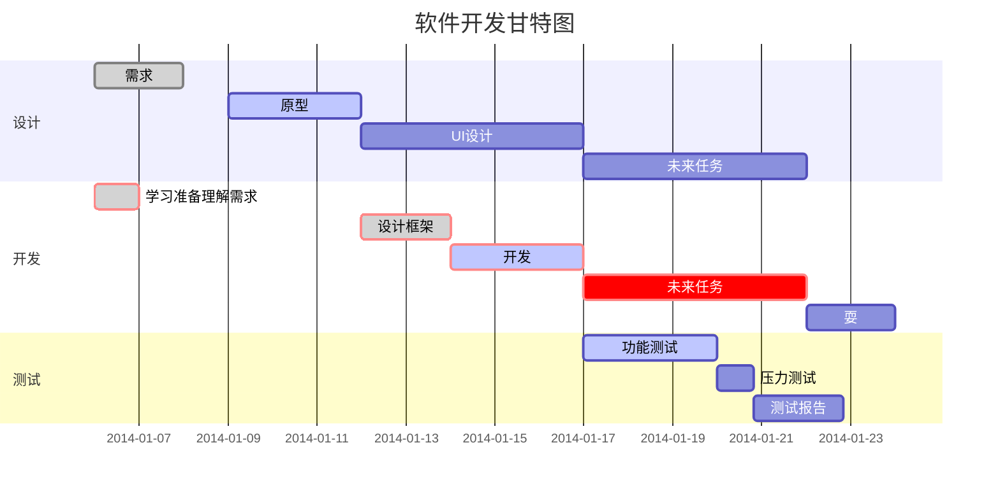

[toc]

# Markdown 语法大全

### 介绍

Markdown 是一种轻量级标记语言，它允许人们使用易读易写的纯文本格式编写文档。

### 基础

> 标题

使用 **#** 号可表示 1-6 级标题，一级标题对应一个 **#** 号，二级标题对应两个 **#** 号，以此类推。

```
# 一级标题
## 二级标题
### 三级标题
#### 四级标题
##### 五级标题
###### 六级标题
```

> 列表

Markdown 支持有序列表和无序列表。

无序列表使用星号(*****)、加号(**+**)或是减号(**-**)作为列表标记，这些标记后面要添加一个空格，然后再填写内容：

```
* 第一项
* 第二项
* 第三项

+ 第一项
+ 第二项
+ 第三项


- 第一项
- 第二项
- 第三项
```

有序列表使用数字并加上 **.** 号来表示，如：

```
1. 第一项
2. 第二项
3. 第三项
```

> 区块

Markdown 区块引用是在段落开头使用 **>** 符号 ，然后后面紧跟一个**空格**符号：

```
> 区块引用
```

> 代码

如果是段落上的一个函数或片段的代码可以用反引号把它包起来（**`**），例如：

```
`printf('')`
```

代码区块使用用 **```** 包裹一段代码:

````
```
代码块
```
````

### 表格

使用 **|** 来分隔不同的单元格，使用 **-** 来分隔表头和其他行。

语法格式如下：

```
|  表头   | 表头  |
|  ----  | ----  |
| 单元格  | 单元格 |
| 单元格  | 单元格 |
```

显示效果如下：

| 表头   | 表头   |
| ------ | ------ |
| 单元格 | 单元格 |
| 单元格 | 单元格 |

###  图片与链接

> 图片

格式：![图片名字] (图片链接)

最后添加一个空格可以实现左对齐

````

````

> 链接

格式：[链接文字] (链接地址)

```
[Alibab](https://docs.alibabagroup.com/assets2/images/cn/home/home_banner_1.png)
```

### 兼容 HTML

不在 Markdown 涵盖范围之内的标签，都可以直接在文档里面用 HTML 撰写。

目前支持的 HTML 元素有：`<kbd> <b> <i> <em> <sup> <sub> <br>`等 ，如：

### 文档目录

使用 `[toc]` 标签可直接生成当前文档的目录结构

### 目录树

```
─aero
    │  aero.msstyles
    │  aerolite.msstyles
    │
    ├─en-US
    │      aero.msstyles.mui
    │      aerolite.msstyles.mui
    │
    ├─Shell
    │  └─NormalColor
    │      │  shellstyle.dll
    │      │
    │      └─en-US
    │              shellstyle.dll.mui
    │
    ├─VSCache
    └─zh-CN
            aero.msstyles.mui
            aerolite.msstyles.mui
```

#### 原理

在 cmd 中进入项目目录，使用 `tree` 相关命令，输出目录结构，然后粘贴到 markdown 中即可。

#### 步骤

- 进入项目根目录文件夹，在资源管理器上方文件路径前面输入 `cmd` 或者 `powershell` 回车进入当前目录。

- 输入 `tree` 显示根目录文件夹下 所有文件夹，输入 `tree /f` 显示根目录文件夹下的所有文件。
- 选中目录树 键盘 `ctrl+C` 即复制到粘贴板了。然后就可以粘到 markdown 文件中。

### 画图

#### 横向流程图源码格式



````

````

#### 竖向流程图源码格式



````

````

#### 标准流程图源码格式

```flow
st=>start: 开始框
op=>operation: 处理框
cond=>condition: 判断框(是或否?)
sub1=>subroutine: 子流程
io=>inputoutput: 输入输出框
e=>end: 结束框
st->op->cond
cond(yes)->io->e
cond(no)->sub1(right)->op
```

````
```flow
st=>start: 开始框
op=>operation: 处理框
cond=>condition: 判断框(是或否?)
sub1=>subroutine: 子流程
io=>inputoutput: 输入输出框
e=>end: 结束框
st->op->cond
cond(yes)->io->e
cond(no)->sub1(right)->op
```
````

#### 标准流程图源码格式（横向）

```flow
st=>start: 开始框
op=>operation: 处理框
cond=>condition: 判断框(是或否?)
sub1=>subroutine: 子流程
io=>inputoutput: 输入输出框
e=>end: 结束框
st(right)->op(right)->cond
cond(yes)->io(bottom)->e
cond(no)->sub1(right)->op
```

````
```flow
st=>start: 开始框
op=>operation: 处理框
cond=>condition: 判断框(是或否?)
sub1=>subroutine: 子流程
io=>inputoutput: 输入输出框
e=>end: 结束框
st(right)->op(right)->cond
cond(yes)->io(bottom)->e
cond(no)->sub1(right)->op
```
````

#### UML时序图源码样例

````
```sequence
对象A->对象B: 对象B你好吗?（请求）
Note right of 对象B: 对象B的描述
Note left of 对象A: 对象A的描述(提示)
对象B-->对象A: 我很好(响应)
对象A->对象B: 你真的好吗？
```
````

#### UML时序图源码复杂样例

```sequence
Title: 标题：复杂使用
对象A->对象B: 对象B你好吗?（请求）
Note right of 对象B: 对象B的描述
Note left of 对象A: 对象A的描述(提示)
对象B-->对象A: 我很好(响应)
对象B->小三: 你好吗
小三-->>对象A: 对象B找我了
对象A->对象B: 你真的好吗？
Note over 小三,对象B: 我们是朋友
participant C
Note right of C: 没人陪我玩
```

````
```sequence
Title: 标题：复杂使用
对象A->对象B: 对象B你好吗?（请求）
Note right of 对象B: 对象B的描述
Note left of 对象A: 对象A的描述(提示)
对象B-->对象A: 我很好(响应)
对象B->小三: 你好吗
小三-->>对象A: 对象B找我了
对象A->对象B: 你真的好吗？
Note over 小三,对象B: 我们是朋友
participant C
Note right of C: 没人陪我玩
```
````

#### UML标准时序图样例



````

````

#### 甘特图样例



````

````